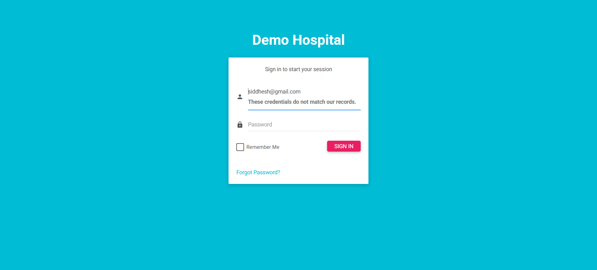
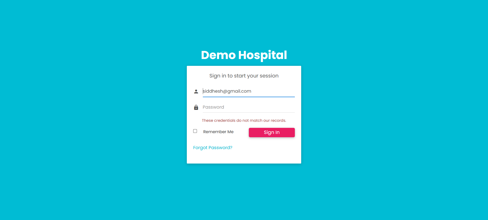
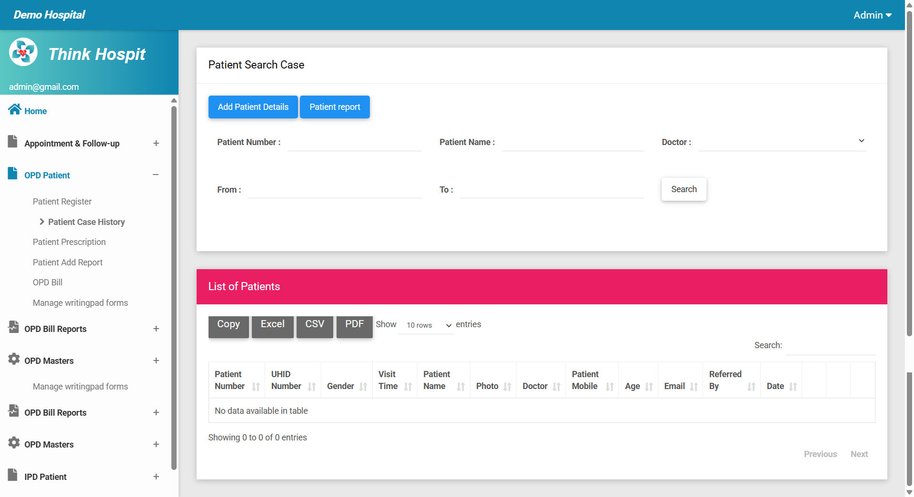
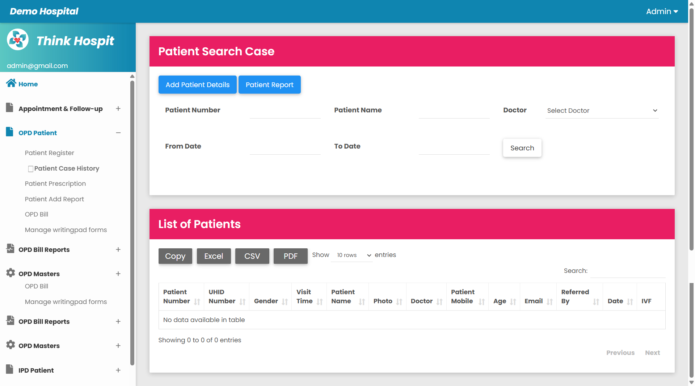
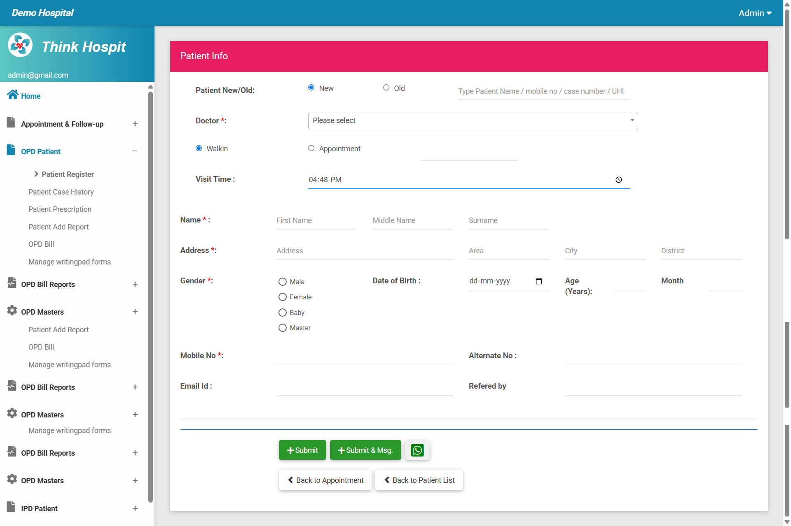
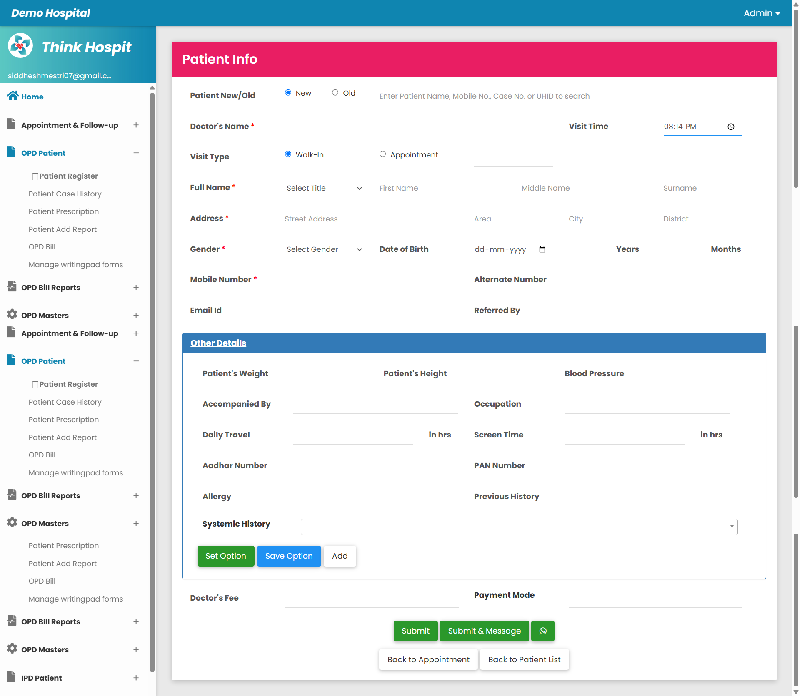
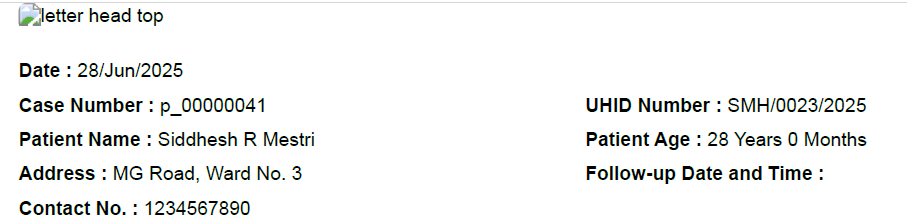

# Legacy Hospital Management UI Cleanup & Refactor (Laravel Blade)

## Project Overview

This project involved working on a legacy Hospital Management System built using Laravel and Blade templates. The codebase was unstructured, inconsistent, and lacked version control, formatting, and logical clarity. My goal was to bring **UI consistency**, **code readability**, and **functional clarity** to the project, all while reverse-engineering undocumented logic and restoring functionality in several places.

> While this is primarily a **UI-centric refactor case study**, the work extended beyond surface-level improvements. I actively navigated and reverse-engineered backend logic, restored broken controller segments, and made necessary backend changes to support UI consistency and data accuracy throughout the system.

---

## Objectives

- Improve **UI consistency** across Blade files
- Format and structure HTML, PHP (Blade), and JavaScript for clarity
- Remove dead code, commented blocks, redundant files
- Fix **functional issues** caused by broken or missing logic
- Add meaningful labels, placeholders, and accessibility hints
- Ensure clean separation between layout, logic, and presentation

---

## Key Contributions

### Code Cleanup & Standardization

- Reorganized Blade components using proper grid system (Bootstrap classes like `col-md-*`)
- Converted radio groups to dropdowns where appropriate
- Standardized button styles, labels, and spacing for consistency
- Formatted all HTML/PHP code with proper indentation and structure

### Fixes to Legacy Code

- Identified and fixed controllers that were **commented out**, leading to non-functioning forms
- Handled syntax errors that were silently breaking Blade rendering (e.g., unclosed `@if`)
- Migrated Laravel Blade comment syntax (`{{-- --}}`) properly to avoid compilation errors

### UI Enhancements

- Added clear, semantic labels (e.g., “Visit Type” instead of “Case Type”)
- Improved placeholders: `"Enter Patient Name, Mobile No., Case No. or UHID to search"`, more intuitive alternatives
- Ensured consistent desktop UI layout using Bootstrap’s grid system (Note: Mobile responsiveness was not in scope)

---

## Before & After (Screenshots)

- **Login Page** - Aligned input labels and improved error message visibility for better UX.
  **Before**
  
  **After**
  

- **Case Masters** - Improved layout, field grouping and buttons for patient case history with better spacing, label clarity, and visual alignment.
  **Before**
  
  **After**
  

- **KYC Patient Info** - Refactored Patient Info form UI for better field alignment, grouping, and cleaner layout.
  **Before**
  
  **After**
  

- **Patient Case History PDF** - Address now includes full details (e.g., "MG Road, Ward No. 3, South Block, Badlapur, Thane").
  **Before**
  
  **After**
  

---

## Development Environment

- Laravel (Blade templating engine)
- Bootstrap (for layout structure)
- Custom JavaScript logic
- XAMPP for local development

---

## Challenges Faced

- No initial version control, worked with raw ZIP files
- The Controller logic was commented, or partially written
- Syntax errors in deeply nested Blade logic
- HTML blocks misused and minified or unreadable CSS
- Unused local backups and copied files
- No mobile responsiveness (outside scope)

---

## Portfolio Value

This project represents my ability to:

- Work with **legacy code** without documentation
- Understand and fix **UI + logic inconsistencies**
- Apply **clean code principles** to chaotic environments
- Track, document, and present changes effectively

> Even if the project doesn’t continue, the skills demonstrated here are highly applicable in any team dealing with unmaintained or poorly structured codebases.

---

## Extra Materials

- `screenshots/`: Before & After views of fixed pages

---

## Project Status

- UI Refactoring Completed for 2 Core Pages
- PDF output for patient case history corrected (address - now includes area, city, district)
- Open to extending to more screens if needed for stronger portfolio depth
- Full backend audit not within current scope

---

## About Me

You can learn more about me and my other projects on my [personal portfolio website](https://siddheshmestri.online).
